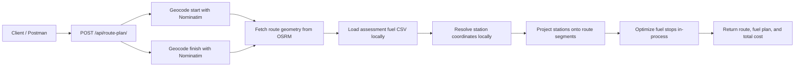

# Route Fuel Planner

Fuel-aware routing for US road trips. Submit a start and finish location, receive the route geometry, cost-effective fuel stops along the way, and the estimated total fuel spend.

## Highlights

- Django 5.2 API
- Free map and routing via Nominatim + OSRM
- Local fuel-price dataset from the assessment CSV
- Route geometry returned as GeoJSON
- Fuel stops optimized for a 500 mile range and 10 mpg

## API Flow



## Endpoint

`POST /api/route-plan/`

Example request:

```json
{
  "start": "Los Angeles, CA",
  "finish": "New York, NY"
}
```

What the response includes:

- `route.map.geometry` as a GeoJSON `LineString`
- `fuel_plan` with the selected stops and the next leg each one covers
- `summary.total_fuel_cost` with the full trip fuel cost

## Quick Start

```bash
pip install -r requirements.txt
python manage.py migrate
python manage.py check
python manage.py test
python manage.py runserver
```

The API will be available at `http://localhost:8000/api/route-plan/`.

## Try It in Postman

1. Open Postman.
2. Import `Route_Fuel_Planner_API.postman_collection.json`.
3. Send one of the included requests:
   - **LA to New York** - long cross-country route with many stops
   - **San Francisco to Las Vegas** - shorter western route
   - **Phoenix to Denver** - mountain corridor example
   - **Chicago to Boston** - Midwest-to-Northeast example
   - **Coordinates format** - same route using `lat,lon` input

## Response Shape

```json
{
  "input": {
    "start": "Los Angeles, CA",
    "finish": "New York, NY"
  },
  "route": {
    "distance_miles": 2799.23,
    "duration_minutes": 2444.5,
    "map": {
      "type": "Feature",
      "geometry": {
        "type": "LineString",
        "coordinates": [[-118.243683, 34.052235], [..]]
      }
    }
  },
  "fuel_plan": [
    {
      "sequence": 1,
      "station": {
        "name": "Valley Fuel, Phoenix, AZ",
        "city": "Phoenix",
        "state": "AZ",
        "route_position_miles": 312.45,
        "distance_from_route_miles": 1.8,
        "price_per_gallon": 4.19
      },
      "next_leg": {
        "destination": "Trip finish",
        "distance_miles": 287.32,
        "gallons_needed": 28.73
      },
      "gallons_purchased": 28.73,
      "cost": 120.32
    }
  ],
  "summary": {
    "total_fuel_cost": 847.5,
    "gallons_purchased": 279.75,
    "tank_range_miles": 500,
    "fuel_efficiency_mpg": 10,
    "stops_required": 5
  }
}
```

## Project Structure

- `planner/services.py` contains geocoding, routing, station matching, and fuel optimization
- `planner/views.py` exposes the API endpoint
- `planner/tests.py` covers the planner logic and the API view
- `demo_api.py` demonstrates the API from the terminal
- `Route_Fuel_Planner_API.postman_collection.json` is ready to import into Postman

## Notes

- The vehicle starts with a full tank and a 500 mile maximum range.
- Fuel efficiency is fixed at 10 mpg.
- The API makes one geocoding call per endpoint side and one routing call for the trip.
- Fuel stops are projected onto simplified route segments to keep matching fast.
- The app is wired to `data/fuel-prices-for-be-assessment.csv`.
- The assessment CSV uses these columns:
  - `OPIS Truckstop ID`
  - `Truckstop Name`
  - `Address`
  - `City`
  - `State`
  - `Rack ID`
  - `Retail Price`
- Station coordinates are resolved locally from city and state using `geonamescache`, including Canadian province aliases.
